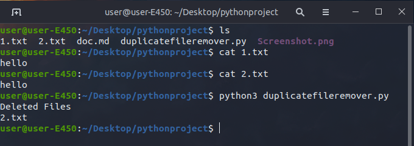

# Duplicate Files Remover
This script removes duplicate files in the directory where the script runs.

### How to run the script
Execute `python3 duplicatefileremover.py` 

### Screenshot/GIF showing the sample use of the script
<!--Remove the below lines and add yours -->

## Working
The script first lists all the files in the directory. It takes MD5 hash of each file, when hash of 2 files become same it deletes the file.

## Author Name
[Mohit Kumar Lavatre_31 , Ranjit Ranjan_39,Amit Gupta_10, Ritesh Kumar Pradhan_40](https://github.com/mohitlavatre9)
